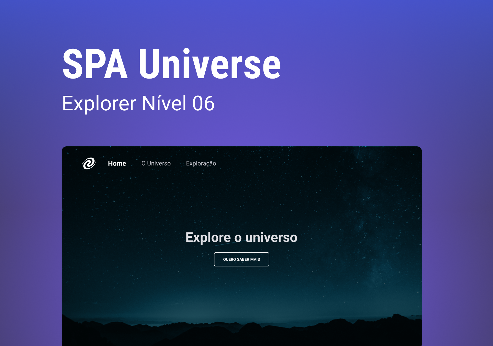

# SPA Universe

# Sobre o desafio

Aqui está o [link](https://www.figma.com/file/m8zp3mtxvwyTGQs69nIFM8/%5BDesafios-Explorer%5D-SPA-Universe/duplicate) com o layout da aplicação. Ele abrirá um arquivo igual a imagem abaixo:

O que será abordado nesse desafio:

- Conceitos de SPA;
- Mapeamento de rotas;
- Assíncrono e promises;
- Orientação a objetos;
- Classes e muito mais.
